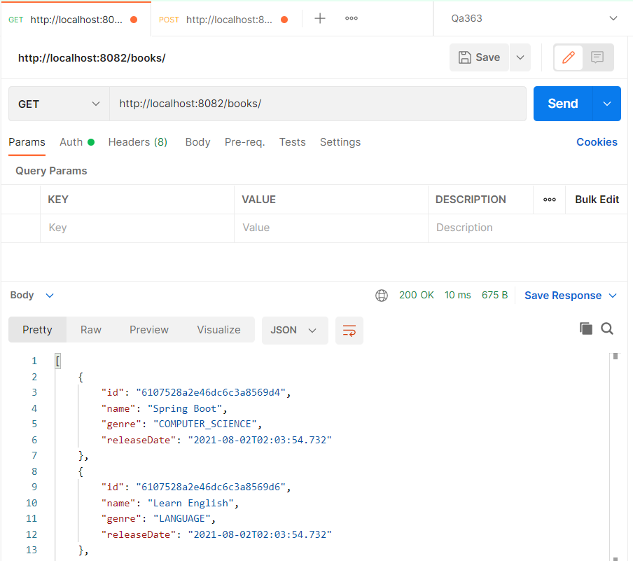
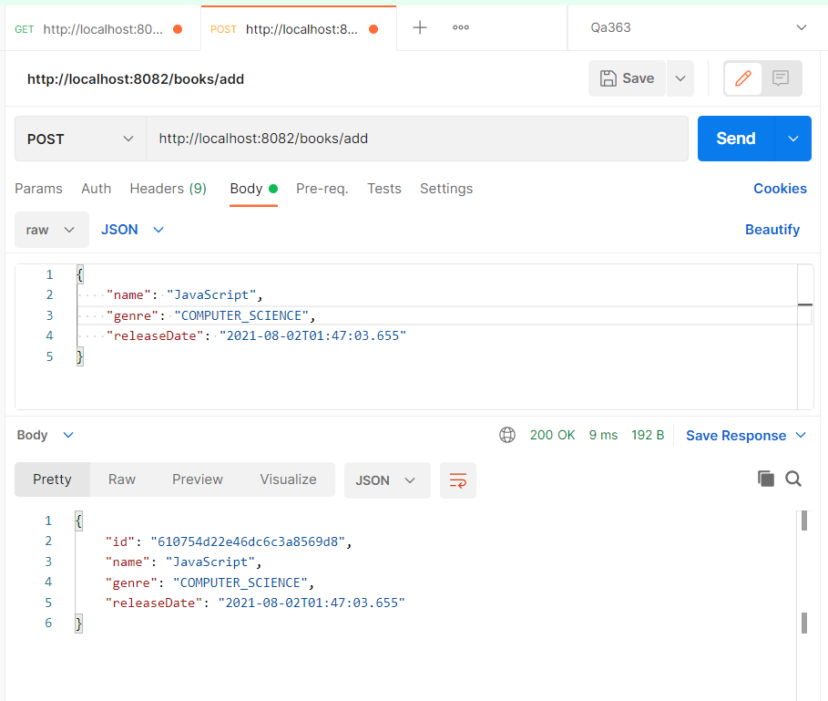

# Getting Started

This project is a REST application based on [Spring] boot(https://spring.io/) and Reactive programming using mongodb-reactive and spring-webflux.

The goal of this project is to do reactive programming using spring framework, mongodb-reactive, Mono, Flux

For further reference, please consider the following sections:

* [Official Apache Maven documentation](https://maven.apache.org/guides/index.html)
* [Spring Boot Maven Plugin Reference Guide](https://docs.spring.io/spring-boot/docs/2.5.3/maven-plugin/reference/html/)
* [Create an OCI image](https://docs.spring.io/spring-boot/docs/2.5.3/maven-plugin/reference/html/#build-image)
* [Spring Data Reactive MongoDB](https://docs.spring.io/spring-boot/docs/2.5.3/reference/htmlsingle/#boot-features-mongodb)


# Technologies used :
    Spring Boot 2.5.3
    Spring 5.3.9
    Netty 4.1.66.Final
    JUnit 4.12
    Maven 3
    Java 11
    Mongodb 4.2
    
  
# Run the application :

To run the Application, you need to have [JDK](http://www.oracle.com/technetwork/java/javase/downloads/index.html), [Maven](https://maven.apache.org/) 

```
Clone the roject and unzip it, go to movie-reactive diractory

cd spring-reactive-web-mongodb
mvn clean package
docker-compose up --build
```


Browse to the app at http://localhost:8082/swagger-ui.html#/ or use postman
 






